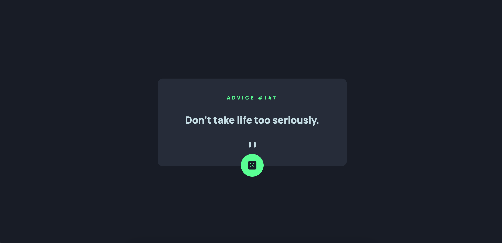
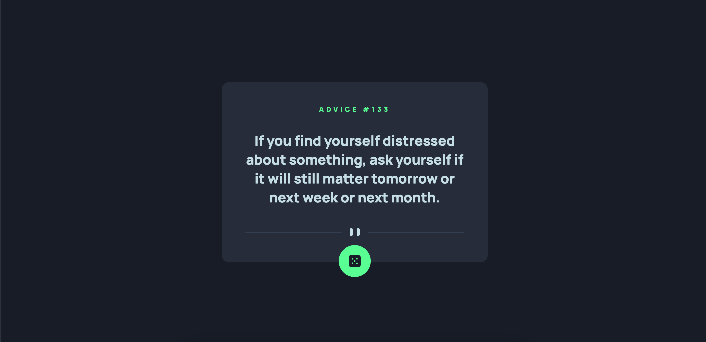
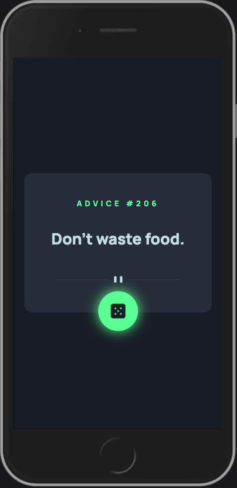

# Frontend Mentor - Advice generator app solution

This is a solution to the [Advice generator app challenge on Frontend Mentor](https://www.frontendmentor.io/challenges/advice-generator-app-QdUG-13db). Frontend Mentor challenges help you improve your coding skills by building realistic projects.

## Table of contents

- [Overview](#overview)
  - [Screenshots](#screenshot)
  - [Links](#links)
- [My process](#my-process)
  - [Built with](#built-with)
  - [What I learned](#what-i-learned)
- [Author](#author)

## Overview

### Screenshots





### Links

- Solution URL: [click!](https://github.com/dimxn/product-preview-card-component-main/)
- Live Site URL: [click!](https://dimxn.github.io/product-preview-card-component-main/)

## My process

### Built with

- Semantic HTML5 markup
- CSS custom properties
- CSS Grid
- Mobile-first workflow

### What I learned

I learned to work with API.
Are shown in more detail below.

```javascript
function getAdvice() {
  advice.style.opacity = 0;
  adviceText.style.opacity = 0;
  fetch("	https://api.adviceslip.com/advice")
    .then((response) => {
      return response.json();
    })
    .then((adviceData) => {
      const Adviceobj = adviceData.slip;
      adviceText.innerHTML = `“${Adviceobj.advice}”`;
      advice.innerHTML = `ADVICE #${Adviceobj.id}`;
      adviceText.style.opacity = 1;
      advice.style.opacity = 1;
    })
    .catch((error) => {
      console.log(error);
    });
}
```

## Author

- Website - [dmytror.pp.ua](https://www.dmytror.pp.ua/)
- Frontend Mentor - [@dimxn](https://www.frontendmentor.io/profile/dimxn)
- Instagram - [@dmytr.off](https://www.instagram.com/dmytr.off)
